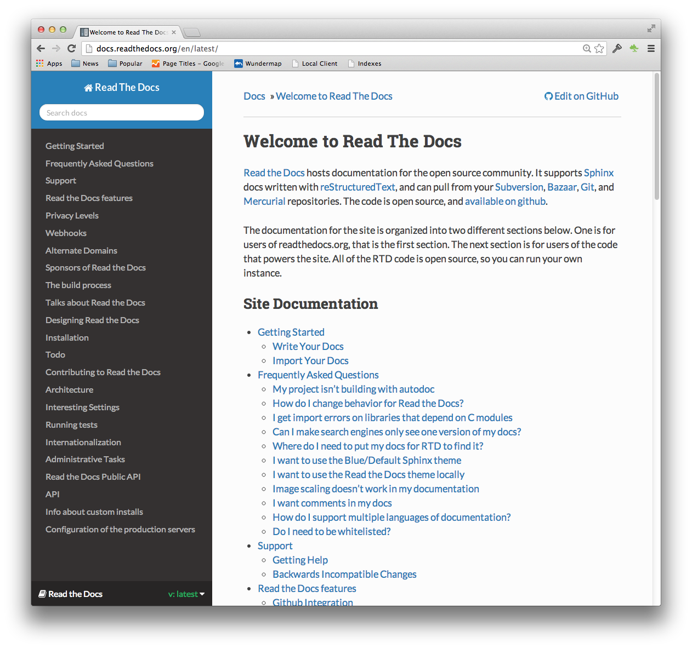

# 2.1 Projektidee (aus dem Einreicheformular)

In dem internen Dokumentationstool (ReadTheDocs, abgekürzt RTD) unserer Firma haben wir einige selbst erstellten Diagramme und Visualisierungen.

[Quelle Bild - ReadTheDocs](../anhang/quellen.html#513-readthedocs)

Diese Visualisierungen müssen als XML zwischengespeichert werden, um bearbeitbar zu bleiben. Dazu gibt es das Online Tool von [Diagramms.net](https://app.diagrams.net/) und ein proprietäres Binary File, welches dieselben Funktionen Offline anbietet.

RTD kann aber nur JPG-Files darstellen. Die Konvertierung von den XML Files zu JPGs benötigt die Installation des proprietären Binary's, welche unser Sicherheit-Verantwortlicher verhindert.

Die einzige Möglichkeit den Anforderungen gerecht zu werden ist die Abkoppelung des Binary's in einem Container.

Ich möchte mittels Jenkins und Docker / Container dies XML-Files via Original Binary zu JPG umwandeln. Es existiert bereits eine kleine Pipeline, welche die RTD-Files aus unserem GIT Repo zu einer HTML-Webseite umwandelt.

Ich möchte an dieser anknüpfen und so erweitern, dass die Files mittels eigens erstellter Container umgewandelt werden. Dies aufgrund der erwähnten unerwünschten Abhängigkeiten des Binary's, welche sich nachteilig auf das Hauptsystem auswirkt.

[Quelle Bild - Jenkins Logo](../anhang/quellen.html#514-jenkins-logo)
