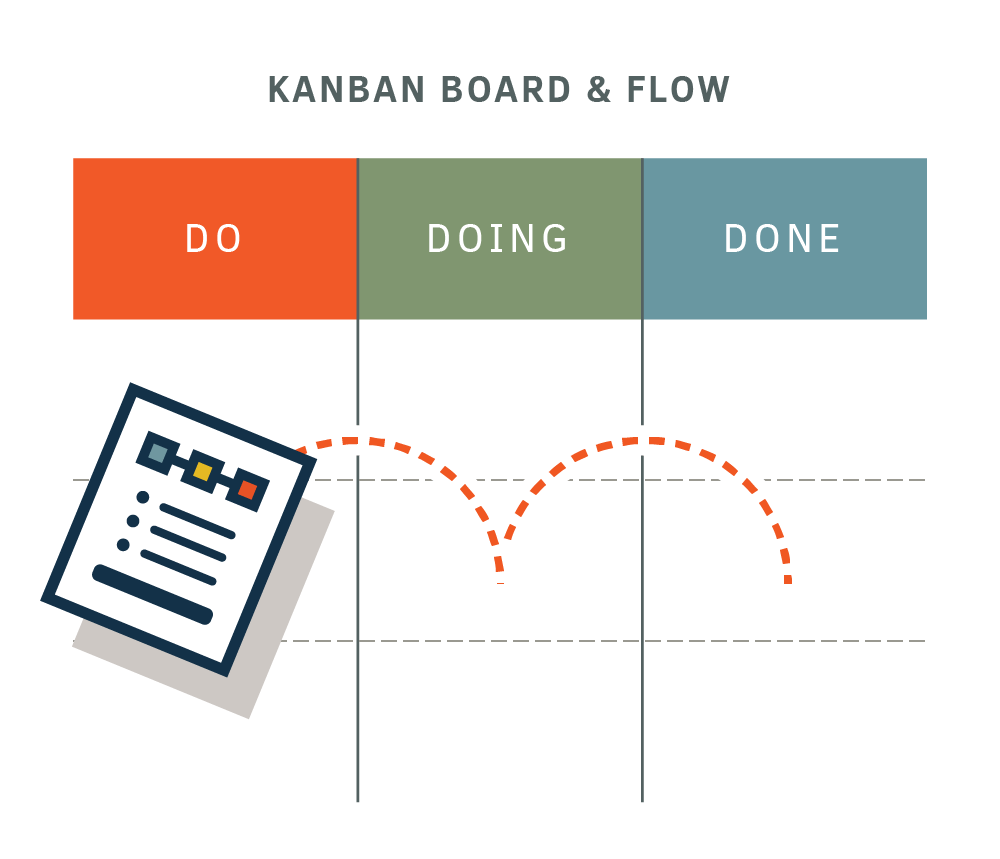

# 2.3 Projektmethode

Als Projektmethode möchte ich möglichst offene und freie Methoden nehmen.
Ich arbeite nach einem LEAN Prinzip, plane nach SCRUM und behalte den Überblick mit KANBAN.

## LEAN Prinzip

Um es in den Worten von Chat-GPT zu sagen:

    Das LEAN-Prinzip ist eine Philosophie und Methodik zur Prozessoptimierung und Effizienzsteigerung in Unternehmen. Hier sind einige Schritte, um nach dem LEAN-Prinzip zu arbeiten:

    1: Verstehen Sie den Wert aus Sicht des Kunden: Identifizieren Sie, was für Ihre Kunden wertvoll ist und wie Ihre Produkte oder Dienstleistungen ihre Bedürfnisse erfüllen.

    2: Identifizieren Sie den Wertstrom: Analysieren Sie den gesamten Ablauf Ihrer Prozesse, um die Schritte zu identifizieren, die zum Erzeugen des Produkts oder der Dienstleistung notwendig sind. Identifizieren Sie dabei auch Verschwendungen (wie unnötige Schritte, Wartezeiten, Überproduktion, Lagerbestände usw.).

    3: Schaffen Sie einen Fluss: Stellen Sie sicher, dass die einzelnen Prozessschritte nahtlos ineinander übergehen, um eine kontinuierliche Produkt- oder Dienstleistungserstellung zu ermöglichen. Entfernen Sie Hindernisse und Engpässe, die den Fluss behindern.

    4: Etablieren Sie Pull-Systeme: Implementieren Sie Systeme, bei denen Produkte oder Dienstleistungen auf Kundenanforderung hin erzeugt werden, anstatt auf Basis von Prognosen oder Überproduktion. Dies minimiert Überbestände und reduziert Verschwendung.

    5: Streben Sie nach Perfektion: Stellen Sie eine Kultur der kontinuierlichen Verbesserung auf. Identifizieren Sie Probleme und Engpässe, suchen Sie nach Lösungen und setzen Sie diese um. Implementieren Sie auch Mechanismen zur Überwachung der Leistung und zur Anpassung von Prozessen.

    6: Betonen Sie Teamarbeit und Mitarbeiterbeteiligung: Einbeziehung und Beteiligung der Mitarbeiter sind entscheidend für den Erfolg von LEAN. Befähigen Sie Ihre Mitarbeiter, ihre Arbeit selbst zu optimieren und nehmen Sie ihre Vorschläge zur Prozessverbesserung ernst.

    Es ist wichtig zu beachten, dass die Einführung von LEAN ein kontinuierlicher Prozess ist. Es erfordert Zeit, Engagement und eine offene Einstellung für Veränderungen. Die Einbindung von Mitarbeitern auf allen Ebenen des Unternehmens ist entscheidend, um erfolgreich nach dem LEAN-Prinzip zu arbeiten.

[Quelle Chat-GPT](../anhang/quellen.html#521-chat-gpt)

Ich verstehe die erwähnten Punkte vorallem so, dass nach Möglichkeit Überschneidungen und Verschwendungen vermeidet werden sollten. Jegliche Zeit, welche ich an einem Punkt investiere, der nicht zum Umfang des eigentlichen Projekts gehört, ist verschwendet. Diese Zeit und Energie könnte an einem anderen weitaus besser eingesetzt werden.

Aus diesem Grunde möchte ich auch meine Projektmethode auf LEAN basieren. Ich möchte meine Zeit und Energie darauf fokussieren das Projekt durchzuführen, statt es zu planen.

## SCRUM

Die Idee hinter Scrum, Sprints zu verwenden, um effiziente Arbeitserledigung zu ermöglichen, finde ich persönlich sehr sympathisch. Ich finde es eine gute Möglichkeit, am Anfang eines Sprint die genauen Ziele zu besprechen und zu definieren und anschliessend möglichst ohne Unterbrechungen an diesem Ziel zu arbeiten.

[Quelle Bild - Scrum Overview](../anhang/quellen.html#511-scrum-overview)

Die "Daily Scrum Meetings" fallen bei diesem Projekt weg, da ich der einzige Stakeholder bin. Ich bin in diesem Falle der Scrum Master, das Entwicklerteam, der Product Owner und der Customer in einem.

Ich finde die sich anbietende Vermischung von Lean und Scrum sehr positiv, da wir mit Lean besonders auf die Einfachheit eines Projekts acht geben, und bei Scrum die Einfachheit aufgrund der separierten Sprints bereits in einem bestimmten Masse gegeben ist.

Wir haben 3 Sprints in dieser Semesterarbeit.

## KANBAN

Kanban ist das Mittel zum Zweck, ich möchte meine noch offenen Tasks übersichtlich darstellen, mit Kanban ist das einfach möglich.

[Bild Quelle - Kanban Beispiel](../anhang/quellen.html#512-kanban-beispiel)

Ich habe 4 Boards:

* Backlog
* In Progress
* Testing
* Done

[Meine Boards sind hier zu sehen.](https://github.com/users/Euthal02/projects/3/views/2)
