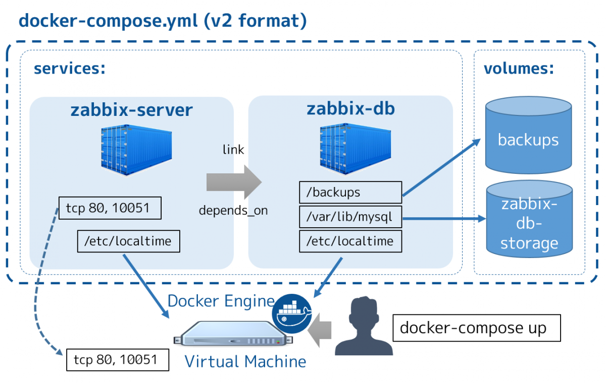

# 3.3 Docker Compose Umsetzung

Ursprünglich war es angedacht die ganze Umformatierung in einem Docker Compose File zu erledigen, mit meiner Entscheidung ein vorerstelltes Image zu verwenden hat sich dies jedoch ergeben.

Mit dem vorerstellten Image ist es um einiges einfacher Sphinx zu nutzen. Ich muss nicht eine Orchestrierung aufgleisen, mit welcher ein Container erstellt wird.

[Quelle Bild - Docker Compose](../anhang/quellen.html#519-docker-compose)

