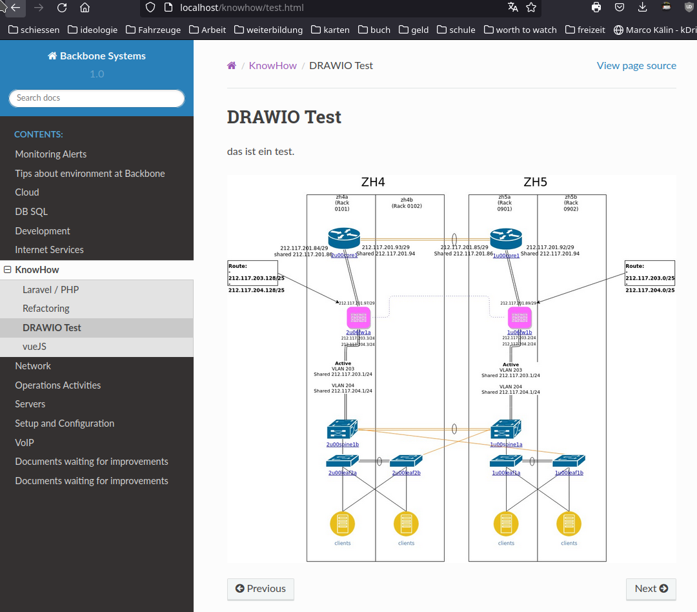

# 3.5 DrawIO Integration

Um nun die DrawIO Files in die Dokumentation zu integrieren, gibt es ein Plugin, welches für Sphinx kreiert wurde.

[Das Plugin ist hier zu finden.](../anhang/quellen.html#523-drawio-plugin)

## Installation

Um das Plugin zu installieren, muss man nur eine PIP Installation starten. [Dies wir dim Dockerfile erledigt.](sphinx_container.html)

Zusätzlich braucht das Plugin auch eine Basis Installation von DrawIO auf dem System, auch dies mache ich im Dockerfile.

## Konfiguration

Das Plugin hat folgende Config Optionen:

```
# Mit dieser Option kann man den Pfad zum Binary überschreiben.
#drawio_binary_path = None

# Mit dieser Option definiert man ob die Installation einen X Server installiert hat. Mit auto findet er dies selber.
#drawio_headless = auto

# Welches File Format als Output generiert werden soll.
#drawio_builder_export_format = {}

# Welche Grösse das File haben soll, in Prozent.
#drawio_default_export_scale = 100

# Transparenz Einstellungen
#drawio_default_transparency = False

# Logging Output
#drawio_disable_verbose_electron = False

# Shared Memory setting, kann Probleme verursachen wenn aktiviert.
#drawio_disable_dev_shm_usage = False

# Falls die GPU genutzt wird, kann es Probleme verursachen.
#drawio_disable_gpu = False

# Diese Option muss in einem Container gesetzt werden.
drawio_no_sandbox = True
```

## Nutzung

Ist die Installation und die Konfiguration erledigt, kann man den Kompiler nutzen. Man nutzt die Funktion folgendermassen, indem man in einem RST File folgendes Direktiv nutzt.

```
.. drawio-figure:: /diagram/Network4.0.xml
    :format: jpg
```

Während dem Compiler wird dieses Direktiv vom Plugin interpretiert und das Diagram wird mit dem DrawIO Binary in ein JPG konvertiert.

Das konvertierte JPG wird dann direkt im HTML integriert.



Quelle Bild - Selbstkreation