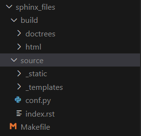

# 3.3 Konvertierung der Files

Mit dem vorerstellten Image von Sphinx direkt und der Möglichkeiten dieser Variante, hat sich das ganze um einiges erleichtert.

Ich kann nun direkt die Konvertierung starten, ohne einen Container erstellen zu müssen.

Sollte ein Sphinx Folder bereits vorhanden sein, kann ich diesen direkt dem Image übergeben und zu HTML Files umschreiben.

## Was ist ein Sphinx Folder?

Ein Sphinx Folder beinhaltet:

* die Source Files, welche umgewandelt werden sollen.
* die Build Destination, wo die umgewandelten Files abgelegt werden.
* Makefile, mit welchem der Sphinx Prozess angestossen wird.

Quelle Ordnersturktur - Selbstkreation

Da dies in meinem Fall sensitive Daten meiner Firma enthalten würde, kann ich diese Daten nicht direkt auf Github teilen.

Falls Einsicht in diese Daten gewünscht werden, kann ich diese bereitstellen.
